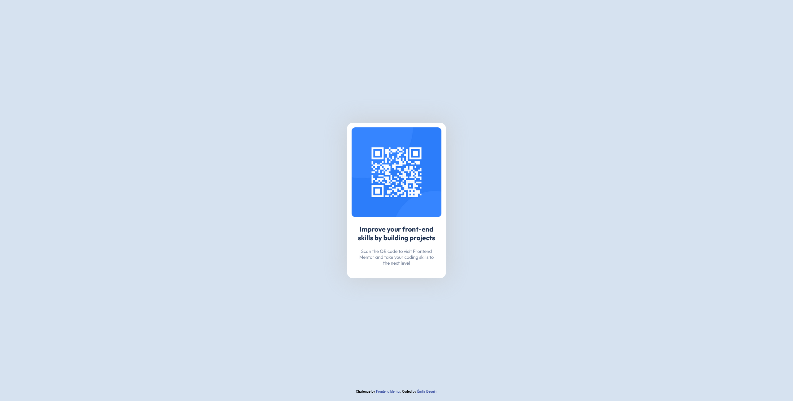

# Frontend Mentor - QR code component solution

This is a solution to the [QR code component challenge on Frontend Mentor](https://www.frontendmentor.io/challenges/qr-code-component-iux_sIO_H). Frontend Mentor challenges help you improve your coding skills by building realistic projects. 

## Table of contents

- [Overview](#overview)
  - [Screenshot](#screenshot)
  - [Links](#links)
- [My process](#my-process)
  - [Built with](#built-with)
  - [What I learned](#what-i-learned)
  - [Useful resources](#useful-resources)
- [Author](#author)

**Note: Delete this note and update the table of contents based on what sections you keep.**

## Overview

### Screenshot



### Links

- Solution URL: [My Github](https://github.com/BahAilime/Frontend-Mentor-Chanllanges/tree/main/QR-code-component)
- Live Site URL: [My Github page](https://bahailime.github.io/Frontend-Mentor-Chanllanges/QR-code-component/)

## My process

### Built with

- Semantic HTML5 markup
- CSS custom properties
- Flexbox
- CSS Grid
- min() function to make it fully responsive

### What I learned

I have learned how to use the min() function to make responsive component without media queries

```css
img {
  border-radius: 27px;
  padding: min(15px, 5vw);
  max-width: min(290px, 85vw);
}
```

### Useful resources

- [Kevin Powell's Youtube channel](https://www.youtube.com/kevinpowell) - helped me a lot to understand how flexbox / grid works

## Author

- Website - [Émilia B](miliab.com)
- Frontend Mentor - [@BahAilime](https://www.frontendmentor.io/profile/yourusername)
