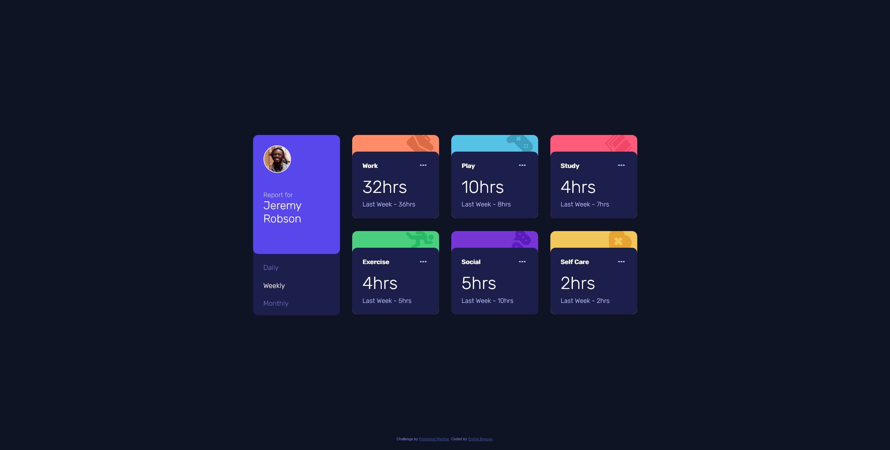

# My Frontend-Mentor chanllanges

- QR-code-component
- Time-tracking-dashboard

## QR-code-component
- Source code: [Github](https://github.com/BahAilime/Frontend-Mentor-Chanllanges/tree/main/QR-code-component)
- Live Site URL: [Github page](https://bahailime.github.io/Frontend-Mentor-Chanllanges/QR-code-component/)

## Time-tracking-dashboard
- Source code: [Github](https://github.com/BahAilime/Frontend-Mentor-Chanllanges/tree/main/Time-tracking-dashboard/)
- Live Site URL: [Github page](https://bahailime.github.io/Frontend-Mentor-Chanllanges/Time-tracking-dashboard/)

