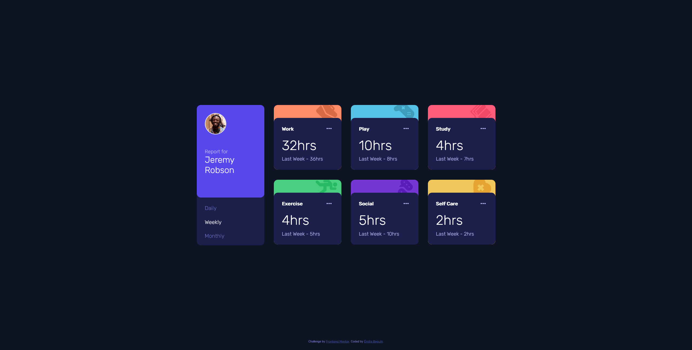
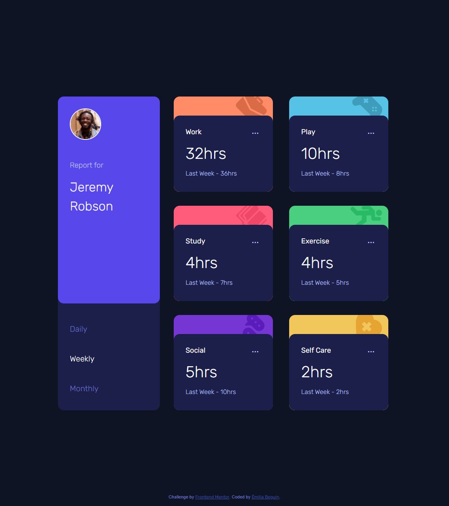
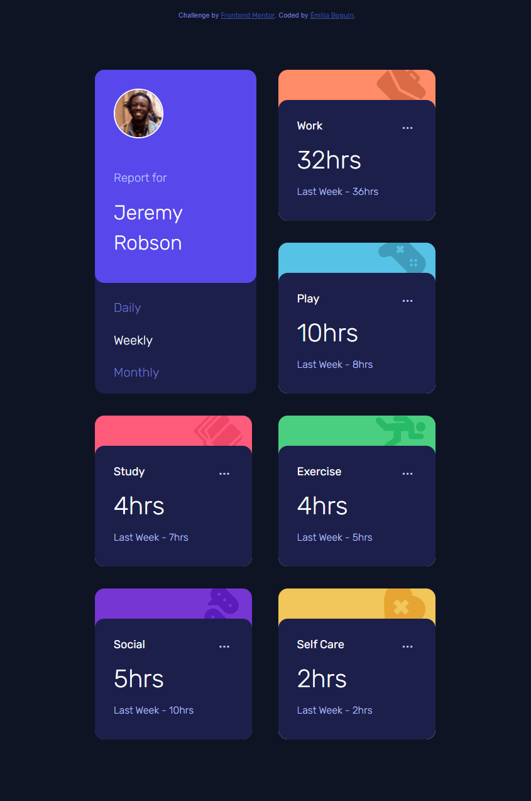

# Frontend Mentor - Time tracking dashboard solution

This is a solution to the [Time tracking dashboard challenge on Frontend Mentor](https://www.frontendmentor.io/challenges/time-tracking-dashboard-UIQ7167Jw). Frontend Mentor challenges help you improve your coding skills by building realistic projects. 

## Table of contents

- [Overview](#overview)
  - [Screenshot](#screenshot)
  - [Links](#links)
- [My process](#my-process)
  - [Built with](#built-with)
  - [What I learned](#what-i-learned)
  - [Useful resources](#useful-resources)
- [Author](#author)
- [Acknowledgments](#acknowledgments)
- [Tweak](#tweak)

## Overview

### Screenshot



### Links

- Solution URL: [My Github](https://github.com/BahAilime/Frontend-Mentor-Chanllanges/tree/main/Time-tracking-dashboard/)
- Live Site URL: [My Github page](https://bahailime.github.io/Frontend-Mentor-Chanllanges/Time-tracking-dashboard/)

## My process

### Built with

- Semantic HTML5 markup
- CSS custom properties
- Flexbox
- CSS Grid
- min() function to make it fully responsive

### What I learned

I leaned how to use `grid-template-areas` to created a complex grid easely

```css
grid-template-areas: 
    "profile . . ."
    "profile . . ."
    ;
```

I learned how to use the ternary operator to determine if it's supporsed to show "hr" or "hrs"

```js
data[0]["timeframes"][state]["current"] > 1 ? "hrs" : "hr"
```

I learnd how to use Emmet to wright my html code quickly

.action>img.icon+div>p.title+p.dots{...}+p.h+p.l
```html
<div class="action">
  
  <div>
    <p class="title">Work</p>
    <p class="dots">...</p>
    <p class="h"></p>
    <p class="l"></p>
  </div>
</div>
```

### Useful resources

- [MDN](https://developer.mozilla.org/en-US/) - I needed some informations about `user-select` and `cursor`

## Author

- Website - [Émilia B](miliab.com)
- Frontend Mentor - [@BahAilime](https://www.frontendmentor.io/profile/yourusername)

## Acknowledgments

- [Abhik](https://github.com/abhik-b) gave me a bunch of good advices to optimise my code (I was using jquery to get the json's data at first)

## Tweak

I have made 2 more states of responsiveness using media queries to make easier to read on tablet / laptop




